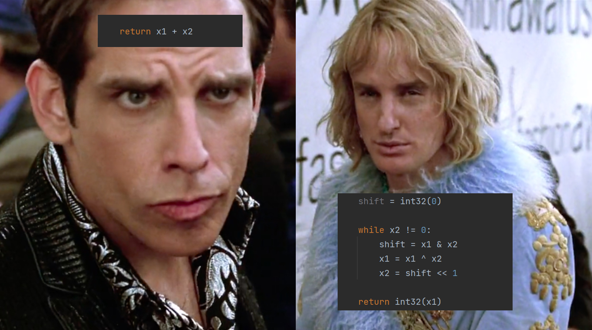

# Handling arithmetic operations at bitwise level

 
 
Current implementation isn't perfect and therefore is not recommended for use in any serious projects, but can provide some clues about how do bitwise operations work and be useful for study purposes.

Current implementation can (and do :clown_face:) contain some misleading parts about arithmetic logic at bitwise level, so learn with care.

At the moment of publishing this code I found much simpler and more efficient ways of implementing things to provide more clear and understandable code, but I decided to post this anyway.

You can see implementation in both [Python](../Python) and [IPython](../Ipython), take care.
